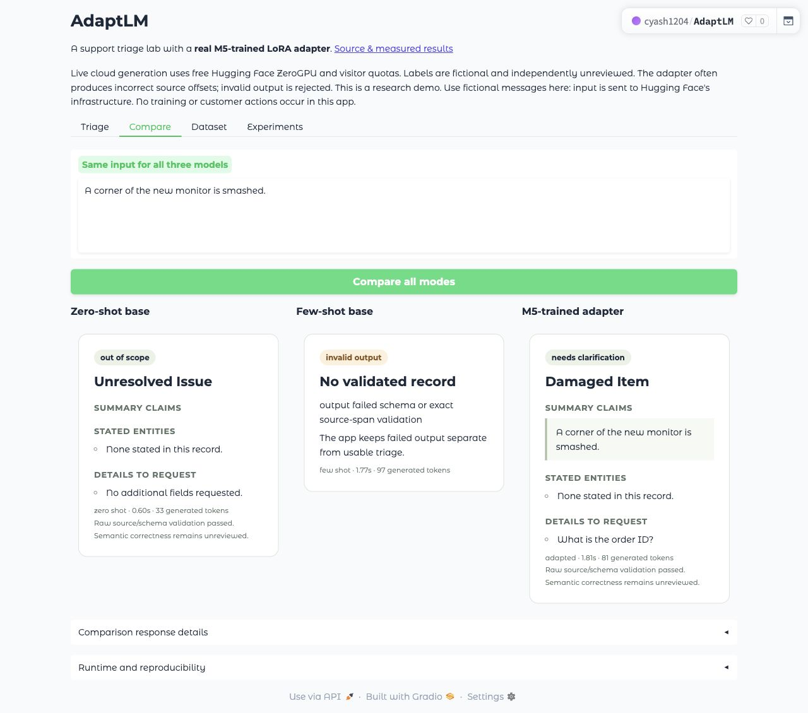
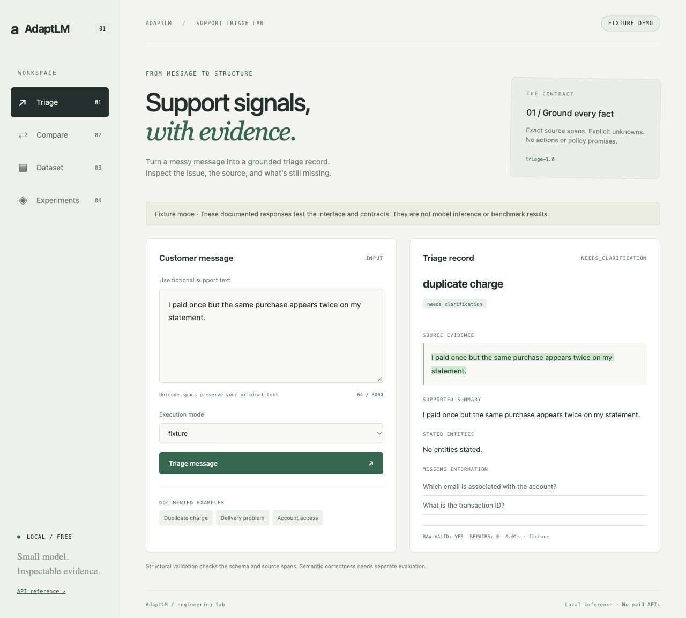

# AdaptLM

**A support triage lab trained on a MacBook Air M5, 24 GB RAM, and deployed on free ZeroGPU.** Converts fictional support messages into a typed issue, exact entity/source spans, operational questions, and source-linked summary claims. Includes a train-only TF-IDF classifier, matched prompted baselines, PEFT/TRL LoRA, bounded FastAPI serving, four browser views, and inspectable experiment records. Source links alone do not prove semantic support.

No paid API, cloud GPU rental, hosted database, tracking service, or external inference provider is required. Service spend for this build is $0; electricity and existing device costs are unmeasured. Base weights use the official pinned Qwen2.5-1.5B-Instruct checkpoint. Training and evaluation remain local. This is an experimental portfolio project, not a policy assistant or action workflow.

**[Open the live cloud app](https://huggingface.co/spaces/cyash1204/AdaptLM)** · **[Public source](https://github.com/cyash24f3/AdaptLM)**. The public app performs real base/adapter generation on free ZeroGPU, with visitor quotas. It uses a separately revalidated PyTorch 2.13 CUDA runtime; the controlled experiments use the original M5/PyTorch 2.14 profile. It can reject invalid model outputs. [Deployment details](docs/cloud-deployment.md).



## Start the credential-free fixture

```sh
uv sync --frozen
uv run --frozen adaptlm data validate
uv run --frozen pytest -q
uv run --frozen adaptlm serve --port 8765
```

Open <http://127.0.0.1:8765>. Choose one of the three documented examples. The banner and execution mode identify **fixture output, not model inference**. Arbitrary text returns unavailable. Compare shows real model modes unavailable in fixture profile. The HTTP walkthrough is `uv run --frozen python scripts/demo.py`.



The default install does not include PyTorch, CUDA, model downloads, or a training requirement. Python 3.12 is required. `uv.lock` pins all resolved supported-profile packages. Existing local `.env` settings may override the fixture profile; set `ADAPTLM_PROFILE=fixture` explicitly when demonstrating this profile.

## Real inference on Apple M5

```sh
uv sync --frozen --extra model --extra train
uv run --extra model python scripts/acquire_model.py
ADAPTLM_PROFILE=local ADAPTLM_DEVICE=mps ADAPTLM_DTYPE=bfloat16 \
  ADAPTLM_ATTENTION_IMPLEMENTATION=sdpa \
  uv run --extra model adaptlm serve --port 8766
```

The download is approximately 3.1 GB plus tokenizer files, in the Hugging Face cache. `configs/model.json` pins `989aa7980e4cf806f80c7fef2b1adb7bc71aa306`, tokenizer revision, license hash, architecture, and model-card parameter/context information. Remote Python model code and pickle weight formats are disabled. `ADAPTLM_OFFLINE=true` requires an already cached pinned snapshot and performs no implicit model/device fallback.

To use an actually trained bundle, set `ADAPTLM_ADAPTER_PATH` to the exported run directory. A missing or incompatible configured bundle makes readiness fail. If no adapter is configured, base zero/few-shot modes remain available and adapted mode returns unavailable. The verified main bundle is `models/main-adapter-214`. It completed 110 optimizer steps over 880 training examples on this M5 in 25.4 minutes and passed gradient, loss-mask, and export/reload diagnostics. Its generated-output comparison is recorded separately in [acceptance.md](docs/acceptance.md) and [the model card](docs/model-card.md).

The published adapter acquisition script is `uv run --extra model python scripts/acquire_adapter.py`; it verifies the frozen release SHA256 and bundle hashes and excludes the separately downloaded base weights. Use a fresh output path if the main bundle already exists.

## Train and resume locally

```sh
uv run --extra model --extra train python scripts/inspect_environment.py
uv run --extra model --extra train adaptlm train \
  --config configs/train-smoke.json --output runs/my-smoke
PYTHONUNBUFFERED=1 uv run --extra model --extra train adaptlm train \
  --config configs/train-m5.json --output models/my-main-adapter
uv run --extra model --extra train adaptlm train \
  --config configs/train-m5.json --output models/my-main-adapter \
  --resume models/my-main-adapter/checkpoint-55
```

Use a fresh output directory for each new run. Resume only an interrupted run from its own locally created Trainer checkpoint and original run.json; config, prompt, dataset, example IDs, model/template and package versions must match. An exported immutable bundle cannot be overwritten. Checkpoints contain locally generated optimizer/scheduler/RNG state. The bundle is an inference artifact, not a resume checkpoint. Review the diagnostic before training: prompt labels are masked, completion/stop tokens receive loss, long sequences fail instead of truncating, and packing is off. Run manifests record seeds, dataset/model/template/code/lock hashes, hyperparameters, selected checkpoint, losses, memory samples, gradients, and export/reload parity. `progress.json` records live optimizer-step progress.

The main profile uses rank-8 q/v LoRA, BF16 base weights, FP32 adapter parameters, batch one, accumulation eight, and one epoch over 880 examples. This model fits storage easily; actual runtime memory depends on the backend, sequence lengths, and other running applications. Earlier PyTorch 2.8 backend investigations and failed runs are preserved. The supported runtime now pins PyTorch 2.14.0 and verifies it locally. No MPS memory-limit bypass is enabled. CUDA configuration is provided separately and is **unverified on this Mac**. No bitsandbytes/QLoRA or CUDA installation is required for MPS.

## Run controlled experiments

```sh
uv run --frozen adaptlm classifier --output runs/new-classifier.json
ADAPTLM_PROFILE=local ADAPTLM_DEVICE=mps ADAPTLM_DTYPE=bfloat16 \
  ADAPTLM_ATTENTION_IMPLEMENTATION=sdpa ADAPTLM_ADAPTER_PATH=models/my-main-adapter \
  uv run --extra model adaptlm evaluate --split validation --output runs/my-validation
ADAPTLM_PROFILE=local ADAPTLM_DEVICE=mps ADAPTLM_DTYPE=bfloat16 \
  ADAPTLM_ATTENTION_IMPLEMENTATION=sdpa ADAPTLM_ADAPTER_PATH=models/my-main-adapter \
  uv run --extra model adaptlm evaluate --split test --output runs/my-test
ADAPTLM_PROFILE=local ADAPTLM_DEVICE=mps ADAPTLM_DTYPE=bfloat16 \
  ADAPTLM_ATTENTION_IMPLEMENTATION=sdpa ADAPTLM_ADAPTER_PATH=models/my-main-adapter \
  uv run --extra model adaptlm benchmark --repeats 10 --concurrency 2 \
  --output runs/my-serving.json
```

Use validation to choose prompts/decoding/checkpoints/targets before testing. Output directories are immutable to preserve first runs. Every generative test evaluation appends exposure metadata. `--variant 0 --limit 10` is an explicitly limited smoke sample, not a full held-out benchmark. Default evaluation includes the complete selected split. Models share the same task prompt, tokenizer, input/output budgets, and greedy decoding; few-shot adds four fixed train-only demonstrations. No final-test demonstrations or gold-based repairs are allowed.

Saved reports include all-attempted and valid-only category scores, exact entities, missing fields, status, raw/final schema validity, unsupported source-span incidence, strict complete reference agreement, errors, slices, paired family bootstrap intervals, and token/timing records. Semantic summary support remains unmeasured until independent human review. A strict reference mismatch can reject an acceptable paraphrase; structural validity can still accept a wrong category or unsupported paraphrase. Read [the annotation guide](docs/annotation-guide.md) and [data card](docs/data-card.md).

The initial classifier test produced 88.0% category agreement and 0.883 macro-F1 over 192 applicable examples, with 48 null-category cases excluded. These are unreviewed authored-label comparisons. It is not a full triage score. Full generation/training status is in the acceptance checklist and saved reports.

## Protected views and API

Use `.env.example` as a settings reference. Set a long random `ADAPTLM_ADMIN_TOKEN` locally; `.env` is ignored. An unconfigured token keeps Dataset and Experiments locked. The browser keeps the supplied token only in memory. Public triage logs contain no submitted messages and nothing is stored from interactive requests.

```sh
curl http://127.0.0.1:8765/api/v1/health
curl http://127.0.0.1:8765/api/v1/ready
curl http://127.0.0.1:8765/api/v1/models
curl -X POST http://127.0.0.1:8766/api/v1/triage \
  -H 'Content-Type: application/json' \
  -d '{"message":"Charged twice yesterday.","mode":"zero_shot"}'
```

API documentation: `/docs`. The worker is serialized and queue admission is bounded. Queue timeouts cannot interrupt an active Metal/CUDA kernel; cancellation holds capacity until generation ends. Invalid output is a failure with no fabricated record. One deterministic JSON-fence repair is reported separately. Unauthorized report/data access fails. HTTP accepts no model paths, training commands, code, or uploads.

## Containers and deployment

```sh
docker build --target fixture -t adaptlm-fixture .
docker run --rm -p 127.0.0.1:8765:8000 adaptlm-fixture
docker compose --profile local-model up --build inference
```

Docker on macOS uses CPU inference; Metal is available to the native process. Use native MPS for your interactive local model. The inference container supports persistent model/cache and report volumes; its default adapter path must match a verified local export. See [deployment.md](docs/deployment.md) for readiness, credentials, volumes, rollback, resource limits, and current verification. The public deployment uses the separate [ZeroGPU profile](docs/cloud-deployment.md).

## Project map and learning

`contracts` defines the schema; `data` owns generation/validation/frozen splits; `baselines` owns category modeling; `training` owns offline PEFT/TRL; `inference` owns prompts/model lifecycle/queue; `evaluation` owns metrics/records; `artifacts` owns manifests/hashes; `observability` samples serving memory; `api` and `web` are thin presentation layers. Ordinary Git excludes model weights, caches, checkpoints, private inputs, and routine runs. Published reports/data contain fictional examples only.

Read [architecture](docs/architecture.md), [annotation guide](docs/annotation-guide.md), [learning guide](docs/learning-guide.md), [free budget](docs/free-budget.md), and [acceptance evidence](docs/acceptance.md). Default CI verifies deterministic fixtures and contracts; opt-in `pytest -m integration` checks actual recorded training diagnostics and is separately labeled.
