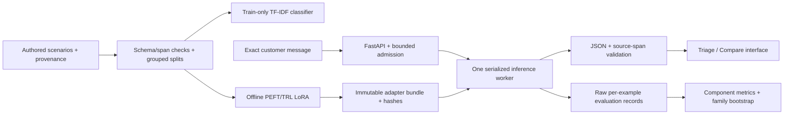

# Architecture and trust boundaries

Fixture mode never imports Transformers or downloads weights. Local mode loads one pinned base and optional PEFT adapter once at startup. All inference and adapter toggles run under one semaphore, including comparisons. Blocking model generation uses a worker thread. Queue admission allows one active job plus two waiting jobs by default. Queue timeouts reject waiting jobs. Cancelling a client request waits for its already-running worker before releasing capacity; HTTP cancellation cannot interrupt Metal/CUDA kernels promptly.

Contracts, data generation, prompts, training, metrics, and inference are callable without HTTP. Training is offline. HTTP accepts only a message and known mode. Users cannot provide filesystem paths, model URLs, training commands, or adapters. Rollback is an operator restart with an existing verified bundle, or removal of the adapter setting to restore base-only availability.

The only repair is removal of a single surrounding Markdown JSON fence. Raw and final validity remain distinct. Category/span rewriting, missing-fact insertion, and gold-based repair are forbidden. Source existence checks are structural, with semantic correctness evaluated separately. Request logs omit messages and raw outputs; request IDs, bounded modes/statuses, queue depth, and duration remain.

Interactive messages and outputs have zero persistence by default. Evaluation uses only committed fictional inputs. Administrator reports and per-example routes require a bearer credential. Deletion removes a report and its evaluation outputs. Frozen dataset membership and append-only test exposure metadata remain intentionally retained; they contain example IDs/configuration, not private submitted messages. Local caches/checkpoints are ignored by Git and remain under operator control.
